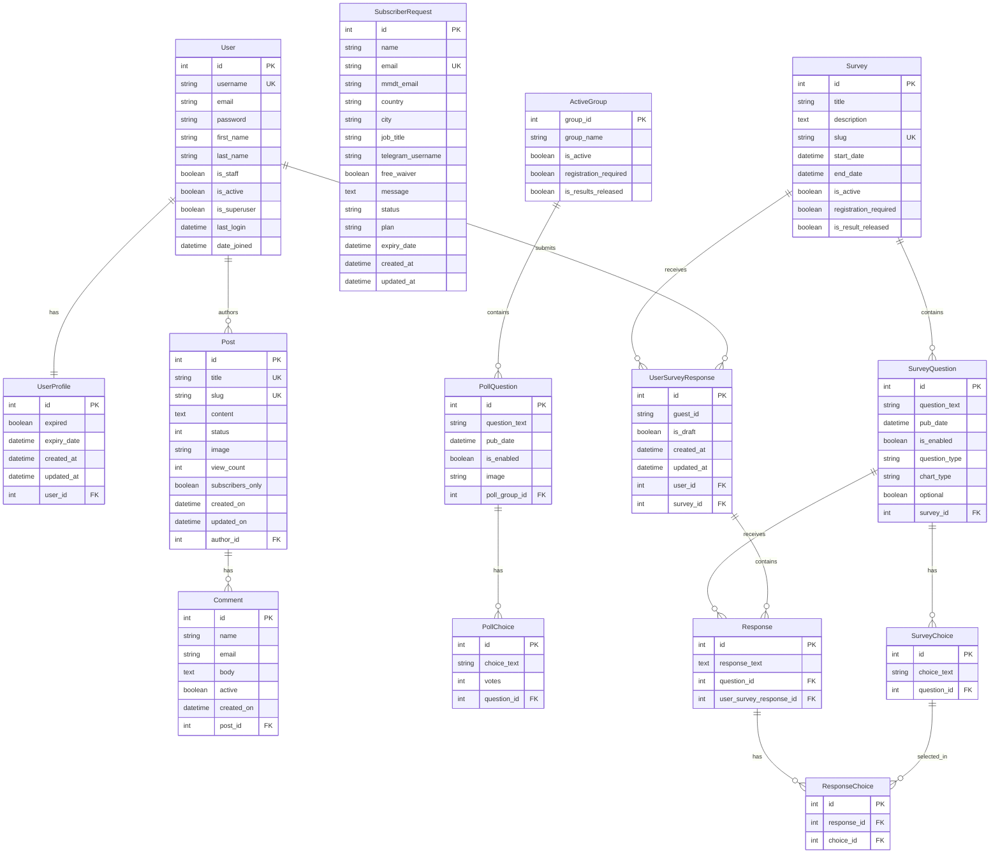

# Myanmar Data Tech Team - Database Schema

## Mermaid ER Diagram

## Model Descriptions

### Blog App

#### **Post**
- Blog posts with rich text content
- Can be marked as subscriber-only
- Tracks view counts
- Status: Draft (0) or Published (1)

#### **Comment**
- Comments on blog posts
- Requires moderation (active flag)
- Ordered by creation time

#### **SubscriberRequest**
- Subscription requests from users
- Includes contact information and Telegram username
- Plans: 6-month ($12) or Annual ($24)
- Status: pending, approved, rejected, or expired
- Automatic expiry date calculation

### Polls App

#### **ActiveGroup**
- Groups polls together
- Controls visibility and registration requirements
- Manages results release

#### **PollQuestion**
- Poll questions with optional images
- Belongs to an active group
- Can be enabled/disabled

#### **PollChoice**
- Choices for poll questions
- Tracks vote counts

### Survey App

#### **Survey**
- Survey containers with title and description
- Time-based activation (start/end dates)
- Optional registration requirement
- Results can be released when ready

#### **UserSurveyResponse**
- Links users (or guests) to survey submissions
- Supports draft mode
- Tracks creation and update times

#### **SurveyQuestion**
- Questions within surveys
- Multiple question types: Text, Multiple Choice, Checkbox, Long Text, Dropdown, Sliding Scale
- Optional chart visualization (Pie/Bar)
- Can be marked as optional

#### **SurveyChoice**
- Answer choices for multiple choice/checkbox questions

#### **Response**
- User's answer to a specific question
- Can be text or selected choices
- Links to UserSurveyResponse

#### **ResponseChoice**
- Junction table for many-to-many relationship
- Links responses to selected choices

## Key Features

- **Authentication**: Django's built-in User model with Allauth integration
- **Content Management**: Blog posts with comments
- **Subscription System**: Tracks subscriber requests with expiry dates
- **Polling System**: Create and manage polls with groups
- **Survey System**: Comprehensive survey creation with multiple question types
- **Guest Support**: Surveys can be taken by anonymous users
- **Draft System**: Save responses as drafts before submission
