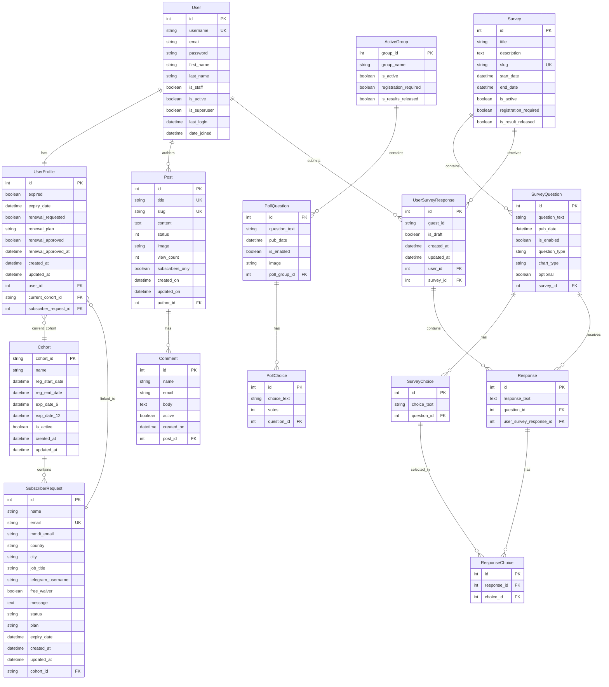

# Myanmar Data Tech - Database Schema

## Mermaid ER Diagram

```mermaid
erDiagram
    %% Auth/User Models
    User {
        int id PK
        string username UK
        string email
        string password
        string first_name
        string last_name
        boolean is_staff
        boolean is_active
        boolean is_superuser
        datetime last_login
        datetime date_joined
    }

    UserProfile {
        int id PK
        boolean expired
        datetime expiry_date
        boolean renewal_requested
        string renewal_plan
        boolean renewal_approved
        datetime renewal_approved_at
        datetime created_at
        datetime updated_at
        int user_id FK
        string current_cohort_id FK
        int subscriber_request_id FK
    }

    %% Blog App Models
    Cohort {
        string cohort_id PK
        string name
        datetime reg_start_date
        datetime reg_end_date
        datetime exp_date_6
        datetime exp_date_12
        boolean is_active
        datetime created_at
        datetime updated_at
    }

    Post {
        int id PK
        string title UK
        string slug UK
        text content
        int status
        string image
        int view_count
        boolean subscribers_only
        datetime created_on
        datetime updated_on
        int author_id FK
    }

    Comment {
        int id PK
        string name
        string email
        text body
        boolean active
        datetime created_on
        int post_id FK
    }

    SubscriberRequest {
        int id PK
        string name
        string email UK
        string mmdt_email
        string country
        string city
        string job_title
        string telegram_username
        boolean free_waiver
        text message
        string status
        string plan
        datetime expiry_date
        datetime created_at
        datetime updated_at
        string cohort_id FK
    }

    %% Polls App Models
    ActiveGroup {
        int group_id PK
        string group_name
        boolean is_active
        boolean registration_required
        boolean is_results_released
    }

    PollQuestion {
        int id PK
        string question_text
        datetime pub_date
        boolean is_enabled
        string image
        int poll_group_id FK
    }

    PollChoice {
        int id PK
        string choice_text
        int votes
        int question_id FK
    }

    %% Survey App Models
    Survey {
        int id PK
        string title
        text description
        string slug UK
        datetime start_date
        datetime end_date
        boolean is_active
        boolean registration_required
        boolean is_result_released
    }

    UserSurveyResponse {
        int id PK
        string guest_id
        boolean is_draft
        datetime created_at
        datetime updated_at
        int user_id FK
        int survey_id FK
    }

    SurveyQuestion {
        int id PK
        string question_text
        datetime pub_date
        boolean is_enabled
        string question_type
        string chart_type
        boolean optional
        int survey_id FK
    }

    SurveyChoice {
        int id PK
        string choice_text
        int question_id FK
    }

    Response {
        int id PK
        text response_text
        int question_id FK
        int user_survey_response_id FK
    }

    ResponseChoice {
        int id PK
        int response_id FK
        int choice_id FK
    }

    %% Relationships
    User ||--|| UserProfile : "has"
    UserProfile }o--|| Cohort : "current_cohort"
    UserProfile }o--|| SubscriberRequest : "linked_to"
    
    User ||--o{ Post : "authors"
    Post ||--o{ Comment : "has"
    
    Cohort ||--o{ SubscriberRequest : "contains"
    
    ActiveGroup ||--o{ PollQuestion : "contains"
    PollQuestion ||--o{ PollChoice : "has"
    
    Survey ||--o{ SurveyQuestion : "contains"
    Survey ||--o{ UserSurveyResponse : "receives"
    User ||--o{ UserSurveyResponse : "submits"
    
    SurveyQuestion ||--o{ SurveyChoice : "has"
    SurveyQuestion ||--o{ Response : "receives"
    UserSurveyResponse ||--o{ Response : "contains"
    
    Response ||--o{ ResponseChoice : "has"
    SurveyChoice ||--o{ ResponseChoice : "selected_in"
```

## Model Descriptions

### Users App

#### **UserProfile**
- Extended user profile linked to Django User model
- Tracks subscription expiry with `expiry_date` and `expired` flag
- `current_cohort`: The cohort the user registered with (not changed on renewal)
- `subscriber_request`: Link to the original SubscriberRequest

**Renewal Fields:**
| Field | Type | Description |
|-------|------|-------------|
| `renewal_requested` | boolean | User has requested membership renewal via API |
| `renewal_plan` | string | Selected plan: '6month' or 'annual' |
| `renewal_approved` | boolean | Admin has approved the renewal |
| `renewal_approved_at` | datetime | When the renewal was approved |

**Renewal Logic:**
- When `renewal_approved` is set to True, `expiry_date` is automatically updated
- New expiry dates are always April 30 or October 31
- 6-month plan: Adds ~6 months (April → October, October → April next year)
- Annual plan: Adds ~12 months (April → April next year, October → October next year)

### Blog App

#### **Cohort**
- Represents a registration cohort/batch of subscribers
- Format: `YYYY_MM` (e.g., '2025_01' for January 2025)
- Controls registration windows and expiry dates

| Field | Type | Description |
|-------|------|-------------|
| `cohort_id` | string (PK) | Format: YYYY_MM |
| `name` | string | Display name (e.g., 'January 2025 Cohort') |
| `reg_start_date` | datetime | Registration window start |
| `reg_end_date` | datetime | Registration window end |
| `exp_date_6` | datetime | Expiry date for 6-month plan |
| `exp_date_12` | datetime | Expiry date for 12-month plan |
| `is_active` | boolean | Is accepting registrations |

#### **Post**
- Blog posts with rich text content
- Can be marked as subscriber-only
- Tracks view counts
- Status: Draft (0) or Published (1)

#### **Comment**
- Comments on blog posts
- Requires moderation (active flag)
- Ordered by creation time

#### **SubscriberRequest**
- Subscription requests from users
- Includes contact information and Telegram username
- Automatically assigned to active cohort on creation
- Google Drive folder created for payment receipts

| Field | Type | Description |
|-------|------|-------------|
| `name` | string | Full name |
| `email` | string (unique) | Email address |
| `mmdt_email` | string | Previous MMDT email (if returning) |
| `telegram_username` | string | Telegram handle |
| `plan` | string | '6month' or 'annual' |
| `status` | string | 'pending', 'approved', 'rejected', 'expired' |
| `cohort` | FK | Auto-assigned cohort |
| `free_waiver` | boolean | Fee waiver request |
| `expiry_date` | datetime | Calculated from cohort |

### Polls App

#### **ActiveGroup**
- Groups polls together
- Controls visibility and registration requirements
- Manages results release

#### **PollQuestion**
- Poll questions with optional images
- Belongs to an active group
- Can be enabled/disabled

#### **PollChoice**
- Choices for poll questions
- Tracks vote counts

### Survey App

#### **Survey**
- Survey containers with title and description
- Time-based activation (start/end dates)
- Optional registration requirement
- Results can be released when ready

#### **UserSurveyResponse**
- Links users (or guests) to survey submissions
- Supports draft mode
- Tracks creation and update times

#### **SurveyQuestion**
- Questions within surveys
- Multiple question types: Text, Multiple Choice, Checkbox, Long Text, Dropdown, Sliding Scale
- Optional chart visualization (Pie/Bar)
- Can be marked as optional

#### **SurveyChoice**
- Answer choices for multiple choice/checkbox questions

#### **Response**
- User's answer to a specific question
- Can be text or selected choices
- Links to UserSurveyResponse

#### **ResponseChoice**
- Junction table for many-to-many relationship
- Links responses to selected choices

## API Endpoints

### Authentication
| Endpoint | Method | Description |
|----------|--------|-------------|
| `/auth/token` | POST | Get JWT token (admin only) |

### User Management
| Endpoint | Method | Auth | Description |
|----------|--------|------|-------------|
| `/api/user/by_email` | GET | JWT | Get user details by email |
| `/api/user/request_renew` | POST | JWT | Submit renewal request |

### Renewal Request Flow
1. Admin calls `/api/user/request_renew` with user's email/telegram and plan
2. System checks if user exists and is active
3. Checks Google Sheet for existing entry (returns URL if found, updates status)
4. If no entry, creates Google Drive folder and logs to sheet
5. Sets `UserProfile.renewal_requested = True` and `renewal_plan`
6. Admin approves via Django admin → `expiry_date` auto-updates

## Key Features

- **Authentication**: Django's built-in User model with Allauth integration, JWT for API
- **Content Management**: Blog posts with comments
- **Subscription System**: 
  - Cohort-based registration with automatic expiry calculation
  - Renewal system with Google Drive/Sheets integration
  - Expiry dates restricted to April 30 or October 31
- **Polling System**: Create and manage polls with groups
- **Survey System**: Comprehensive survey creation with multiple question types
- **Guest Support**: Surveys can be taken by anonymous users
- **Draft System**: Save responses as drafts before submission
- **Google Integration**: Automatic Drive folder creation and Sheets logging
