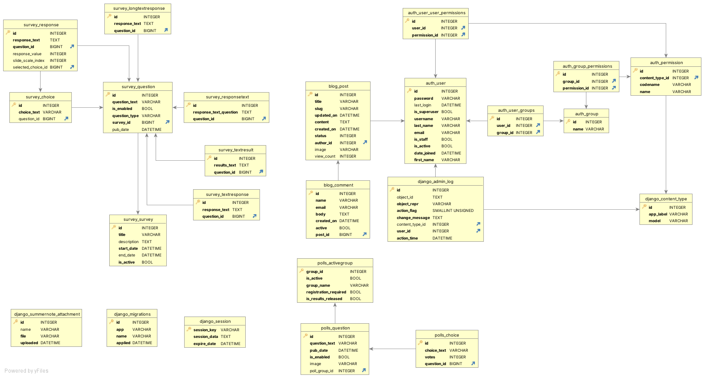

# Myanmar Data Tech Team Web App

## Introduction

Welcome to the Myanmar Data Tech Team web application at https://mmdt.istarvz.com/

This Django-based web application provides content management for the Myanmar Data Tech Team.

## Features

### 📝 Blog System
- **Content Management**: Create and manage blog posts with rich text editing
- **Subscriber-Only Content**: Restrict certain posts to subscribers only
- **Comments System**: Allow readers to comment on blog posts
- **Image Support**: Upload and display images in blog posts
- **View Tracking**: Track post view counts


## Prerequisites for project setup

Before we get started, make sure you have the following installed on your computer:

- **Python 3.9+**: If you don't have Python installed, follow this [guide](https://kinsta.com/knowledgebase/install-python/) to install it.
- **Git**: If you don't have Git installed, follow the instructions [here](https://git-scm.com/book/en/v2/Getting-Started-Installing-Git).

## Project Setup

Let's set up the project step by step:

1. **Clone the Repository**: Download the project files by running this command: `git clone <repository_url>`

2. **Open the Project**: Use your preferred Integrated Development Environment (IDE) to open the project folder.

3. **Create a Virtual Environment** (Recommended): It's a good practice to isolate project dependencies. You can create a virtual environment by following [these instructions](https://docs.python.org/3/tutorial/venv.html).

4. **Install Project Dependencies**: Run the command `pip install -r requirements.txt` to install the necessary libraries. Install setuptools by running the command `pip install setuptools`.
   
5. **Environment Configuration**: Create a `.env` file under `mmdt-web-app/mmdt/.env` and add the following key:value pairs:
    ```
    # Django Configuration
    SECRET_KEY = 'your-secret-key-here'
    DEBUG = True  # Set to False for production
    
    # AWS S3 Configuration (Optional - for file storage)
    AWS_ACCESS_KEY_ID = 'your-aws-access-key'
    AWS_SECRET_ACCESS_KEY = 'your-aws-secret-key'
    AWS_STORAGE_BUCKET_NAME = 'your-s3-bucket-name'
    
    # Email Configuration (Required for user registration)
    EMAIL_HOST_PASSWORD = 'your-email-password'
    ```
   

6. **Database Setup**:
   - Navigate to the project directory: `cd mmdt`
   - Run these commands to set up the database:
     ```
     python manage.py makemigrations
     python manage.py migrate
     ```

7. **Create an Admin User**: Use this command `python manage.py createsuperuser` to create an admin user for managing the application. You'll be prompted to enter a username, email, and password for the admin user.

8. **Run the Project**: Start the web application by running: `python manage.py runserver`

9. **Access the Application**:
You can now access the following URLs in your web browser:
- [http://127.0.0.1:8000/](http://127.0.0.1:8000/): Home Page/Blog Page 
- [http://127.0.0.1:8000/admin](http://127.0.0.1:8000/admin): Admin Panel
- [http://127.0.0.1:8000/our_playground/](http://127.0.0.1:8000/our_playground/): AI Feedback Analyzer

- [http://127.0.0.1:8000/polls/](http://127.0.0.1:8000/polls/): Polls System [draft]
- [http://127.0.0.1:8000/survey/](http://127.0.0.1:8000/survey/): Survey System [draft]
- [http://127.0.0.1:8000/surveys/](http://127.0.0.1:8000/surveys/): Advanced Survey Forms [draft]

## Technology Stack

- **Backend**: Django 4.2.4
- **Database**: SQLite (development)
- **Frontend**: Bootstrap 4, HTML5, CSS3, JavaScript
- **Authentication**: Django Allauth
- **File Storage**: Local (development), AWS S3 (production)
- **AI/ML**: Scikit-learn, NumPy
- **Forms**: Django Crispy Forms
- **Icons**: Bootstrap Icons

## Key Dependencies

- `Django==4.2.4` - Web framework
- `django-allauth==0.63.6` - Authentication system
- `django-summernote==0.8.20.0` - Rich text editor
- `django-form-surveys==2.4.0` - Advanced survey forms
- `scikit-learn==1.2.2` - Machine learning library
- `boto3==1.28.44` - AWS SDK
- `Pillow==10.0.0` - Image processing

## Database Schema

Our Database Design

